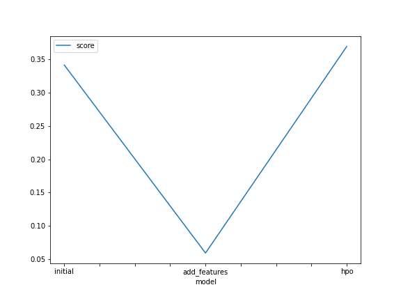
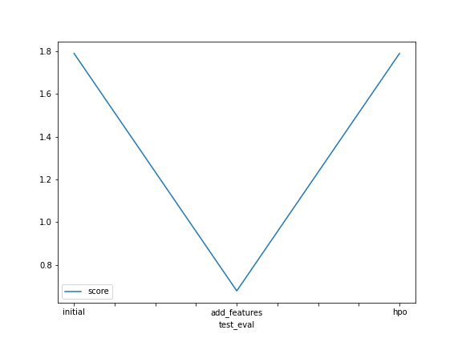

# Report: Predict Bike Sharing Demand with AutoGluon Solution
#### Mohamed Fathi’s notebook

## Initial Training
### What did you realize when you tried to submit your predictions? What changes were needed to the output of the predictor to submit your results?
You can not make any submission unless all the count be positive and that is because of the counts it can not be negative

### What was the top ranked model that performed?
the second one when I added new features

## Exploratory data analysis and feature creation
### What did the exploratory analysis find and how did you add additional features?
that we need to change the type some feature to deal with them in the right way, I added new feature by extracting them form one already there.

### How much better did your model preform after adding additional features and why do you think that is?
the accuracy went up and the error went down, I think because I added important feature that the count depends on.

## Hyper parameter tuning
### How much better did your model preform after trying different hyper parameters?
It did worse because the accuracy went down and the error went up

### If you were given more time with this dataset, where do you think you would spend more time?
I think I will do more feature extraction and more exploratory data analysis.

### Create a table with the models you ran, the hyperparameters modified, and the kaggle score.
|model|hpo1|hpo2|hpo3|score|
|--|"learning_rate"|"num_leaves"|"dropout_prob"|--|
|initial|0.3|1|1|1.78967|
|add_features|0.3|1|1|0.67789|
|hpo|5e-4|36|0.1|1.7896|

### Create a line plot showing the top model score for the three (or more) training runs during the project.

TODO: Replace the image below with your own.

### Create a line plot showing the top kaggle score for the three (or more) prediction submissions during the project.

TODO: Replace the image below with your own.

## Summary
TODO: Add your explanation

I think the most importatn part in the process is exploratory data analysis because when I added more features the model became
much better and in auto machine learning I think it’s better not to do hyperparameter tuning, I think it’s better that it would 
be automated.